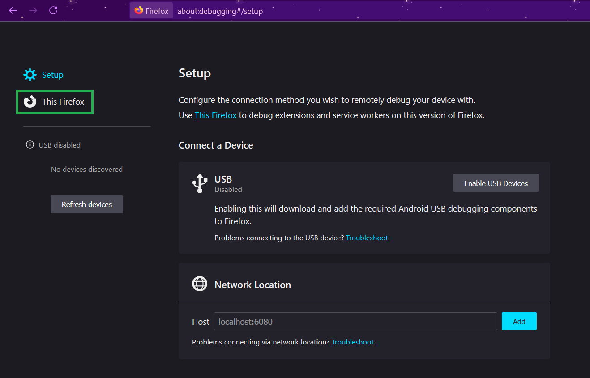
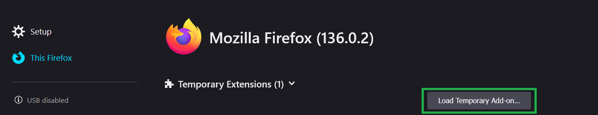
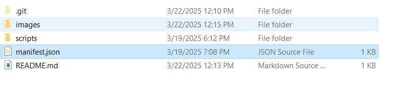
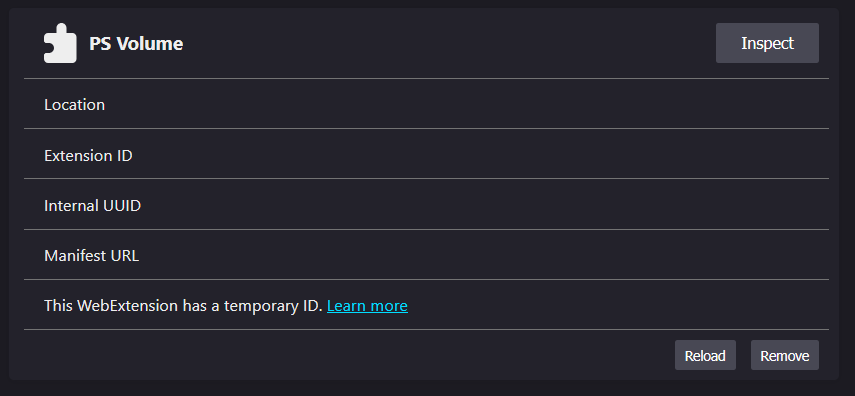
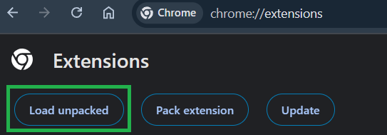
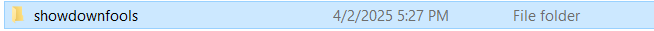
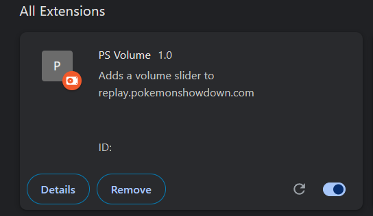

# showdownfools

# The aim of this project is to create re-enable the April Fool's Day sprites.

The current state of this project is extremely simple.
Due to the fact that this is an unofficial add-on, you may have to repeat the installation process upon browser restart.

# Download it here
[Release Link](https://github.com/Confettimaker/showdownfools/releases/tag/1.0)

# How to install this extension (FireFox)

### 1.) Enter `about:debugging` in the URL bar and click `This Firefox`

### 2.) Click `Load Temporary Add-on...`

### 3.) Navigate to the repo and double-click `manifest.json`

### 4.) You should see that the extension has been loaded in FireFox

### 5.) ### 4.) Load up a replay/battle/team and enjoy!

# How to install this extension (Chrome)

### 1.) Enter `chrome://extensions/` in the URL bar and click `Load unpacked`

### 2.) Navigate to and click the repo folder. Then click select.

### 3.) You should see that the extension has been loaded in Chrome

### 4.) Load up a replay/battle/team and enjoy!
